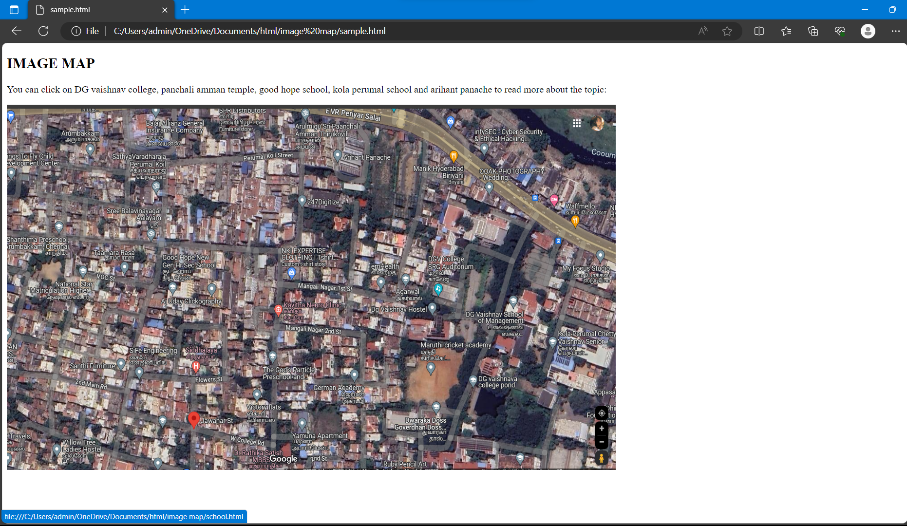

# Places Around Me
NAME : RENUSRI NARAHARASHETTY

REFERENCE NUMBER : 23009126

DEPARTMENT : ARTIFICIAL INTELLIGENCE AND MACHINE LEARNING

# Aim:
To develop a website to display details about the places around my house.

# Design Steps:
## Step 1:
Take screenshots of places around your house using Google Maps.
## Step 2:
Identify a minimum of five different locations and mark them using image maps.
## Step 3:
Develop a webpage(minimum of 50 words) for each location and link it to the image region.
## step 4:
mention the co-ordinates and the link to be appeared when clicked.

# Code:
```
<!DOCTYPE html>
<html>
    <body>
        <h2>IMAGE MAP</h2>
        <P>You can click on DG vaishnav college, panchali amman temple, good hope school, 
        kola perumal school and arihant panache
        to read more about the topic:</P>
        
        <map name="workmap">
            <area shape="poly" coords="1073,698,1241,841,1367,501,1107,394,980,490"  alt="college"
            href="DG.html">
            <area shape="rect" coords="980,26,797,104" alt="temple" href="temple.html">
            <area shape="rect" coords="586,363,403,486" alt="school" href="school.html">
            <area shape="circle" coords="961,138,87" alt="building" href="building.html">
            <area shape="rect" coords="1515,531,1695,723" alt="private school" href="privateschool.html">
          </map>
    </body>
</html>
```

# Output:



# Result:
therefore, when we click a particular point on the image a webpage about the place will appear.

